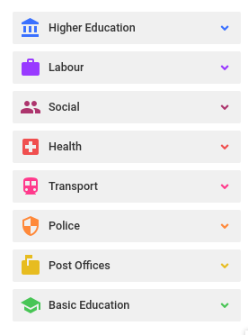

# Point data API

Point data is arranged in the following structure below a given Wazimap NG Profile:

* Themes
  * Categories
    * Points

A common way to fetch points is to

1. Fetch the point themes for a profile, which includes their categories
2. Fetch the points in a category.

Example themes:



Example point categories



**Profile Collections vs Categories**

Note that what is called Profile Collections in Admin is called Categories in the points API.



**Point data identifiers and updates**

Point data themes and collections are continually curated to provide the best user experience.

Avoid hard-coding theme, category and point IDs without documented agreement with profile maintainers that those will remain consistent. Rather agree on names for themes and categories, and notification procedures for updates.

To update points in-place rather than replace entire categories of points, agree on a consistent unique identifier that will be available in the point data fields with the profile administrators.


## Fetch Profile ID

<mark style="color:blue;">`GET`</mark> `https://api.wazimap.com/api/v1/profiles/`

Profile id is required to make requests to points API.\
Get the ID of the profile from the Profile list.



```
{
    "count": 2,
    "next": "https://api.wazimap.com/api/v1/profiles/?page=2",
    "previous": null,
    "results": [
        {
            "id": :profile_id,
            "name": "Profile1",
            "permission_type": "public",
            "requires_authentication": false,
            "geography_hierarchy": {
                "id": 2,
                "name": "2016 SA Boundaries",
                "root_geography": {
                    "name": "South Africa",
                    "code": "ZA",
                    "level": "country",
                    "version": "2016 Boundaries"
                },
                "description": ""
            },
            "description": "",
            "configuration": {}
        },
        {
            "id": :profile_id,
            "name": "Profile2",
            "permission_type": "public",
            "requires_authentication": false,
            "geography_hierarchy": {
                "id": 2,
                "name": "2016 SA Boundaries",
                "root_geography": {
                    "name": "South Africa",
                    "code": "ZA",
                    "level": "country",
                    "version": "2016 Boundaries"
                },
                "description": ""
            },
            "description": "",
            "configuration": {}
        },
        
    ]
}
```



| Field                    | Detail                                                                                                         |
| ------------------------ | -------------------------------------------------------------------------------------------------------------- |
| id                       | ID of the Profile                                                                                              |
| name                     | Profile Name                                                                                                   |
| permission\_type         | Public \| Private - Profile Admin can specify which type of user should be able to view data linked to profile |
| requires\_authentication | Boolean - Decides if the user needs authentication to view data                                                |
| geography\_hierarchy     | Hierarchy for the Profile                                                                                      |
| description              | TextField - Contains short intro about Profile                                                                 |
| configuration            | Profile configurations set up by profile admin                                                                 |

## Get Themes for a Profile

<mark style="color:blue;">`GET`</mark> `https://api.wazimap.com/api/v1/profile/:profile_id/points/themes/`

This API endpoint will return all Themes that are linked to specific Profile\
A Profile can be linked to multiple themes and Themes contains multiple categories.\
\
Example request:\
`GET https://api.wazimap.com/api/v1/profile/8/points/themes/`\


#### Path Parameters

| Name        | Type   | Description       |
| ----------- | ------ | ----------------- |
| profile\_id | number | ID of the profile |



```
[
    {
        "id": :theme_id,
        "categories": [
            {
                "id": :category_id,
                "name": "Healthcare Facilities",
                "description": "Representation of data gathered from various sources",
                "theme": {
                    "id": :theme_id,
                    "name": "Health",
                    
                },
                "metadata": {
                    "source": "",
                    "description": "",
                    "licence": null,
                    "icon": "local_hospital"
                },
                "color": "",
                "visible_tooltip_attributes": []
            }
        ],
        "created": "2020-08-28T07:36:30+0000",
        "updated": "2021-06-08T16:30:14+0000",
        "name": "Health",
        "icon": "local_hospital",
        "order": 1    ,
        "profile": :profile_id
    },
]
```



| Field      | Description                                                                       |
| ---------- | --------------------------------------------------------------------------------- |
| ID         | Theme ID                                                                          |
| name       | Name of the Theme                                                                 |
| icon       | Icon used to display on Theme                                                     |
| order      | Order in which themes are displayed in UI                                         |
| profile    | ID of the Linked Profile                                                          |
| categories | List of sub-data that displays more information and points available for a Theme  |

## Get Categories for a Theme

<mark style="color:blue;">`GET`</mark> `https:/``/api.wazimap.com/api/v1/profile/:profile_id/points/theme/:theme_id/profile_categories/`

Get all categories under a Theme

#### Path Parameters

| Name        | Type   | Description       |
| ----------- | ------ | ----------------- |
| profile\_id | number | ID of the Profile |
| theme\_id   | number | ID of the theme   |



```
[
    {
        "id": :category_id,
        "name": "Healthcare Facilities",
        "description": "Representation of data gathered from various sources",
        "theme": {
            "id": :theme_id,
            "name": "Health",
            "icon": "local_hospital"
        },
        "metadata": {
            "source": "",
            "description": "Representation of data gathered from various sources",
            "licence": null
        },
        "color": "",
        "visible_tooltip_attributes": []
    }
]
```



| Field       | Description                                |
| ----------- | ------------------------------------------ |
| ID          | Category ID                                |
| name        | Name of category                           |
| description | Description to explain info about category |
| theme       | Linked Theme obj Details                   |
| Metadata    | Information about the source of data       |

## Get Points for a Category

<mark style="color:blue;">`GET`</mark> `https://``api.wazimap.com/api/v1/profile/:profile_id/points/category/:category_id/points/`

Get coordinates and location details for a category.\
Example request:\
`GET https://api.wazimap.com/api/v1/profile/8/points/category/578/points/`

#### Path Parameters

| Name         | Type   | Description        |
| ------------ | ------ | ------------------ |
| profile\_id  | number | ID of the Profile  |
| category\_id | number | ID of the Category |



```
{
    "type": "FeatureCollection",
    "features": [
        {
            "id": :location_id,
            "type": "Feature",
            "geometry": {
                "type": "Point",
                "coordinates": [
                    26.643601,
                    -27.748028
                ]
            },
            "properties": {
                "data": [],
                "name": "ALLANRIDGE",
                "url": null,
                "image": null
            }
        },
        {
            "id": :location_id,
            "type": "Feature",
            "geometry": {
                "type": "Point",
                "coordinates": [
                    29.110443,
                    -22.680732
                ]
            },
            "properties": {...}
        },
        {
            "id": :location_id,
            "type": "Feature",
            "geometry": {
                "type": "Point",
                "coordinates": [
                    28.131317,
                    -26.318641
                ]
            },
            "properties": {...}
        }
    ]
}
```



| Field                 | Description                                                                                                                                                                                                                                                          |
| --------------------- | -------------------------------------------------------------------------------------------------------------------------------------------------------------------------------------------------------------------------------------------------------------------- |
| features              | List of coordinates inside a category                                                                                                                                                                                                                                |
| features > id         | Location ID                                                                                                                                                                                                                                                          |
| features > geometry   | Coordinate details for a Location                                                                                                                                                                                                                                    |
| features > properties | <p>Data associated with coordinates. It can include anything profile admin wants to display in association with location. ex: Name, Phone number, Detailed address etc.</p><p>There is also option for profile admin to have url and image in feature properties</p> |

## Get Categories & Points for a Geography

<mark style="color:blue;">`GET`</mark> `https://api.wazimap.com/api/v1/profile/:profile_id/points/geography/:geography_code/points/`

Get points within a Geography.\
API returns Categories within Geography with all the points associated with specific Category inside requested Geo Code

#### Path Parameters

| Name            | Type   | Description            |
| --------------- | ------ | ---------------------- |
| profile\_id     | number | ID of the profile      |
| geography\_code | string | Geo Code for Geography |



```
{
    count: 2,
    results: [
        {
            type: "FeatureCollection",
            features: [
                {
                    "id": :location_id,
                    "type": "Feature",
                    "geometry": {
                        "type": "Point",
                        "coordinates": [
                            26.643601,
                            -27.748028
                        ]
                    },
                    "properties": {...}
                },
            ],
            category: "Post Office service points"
        },
        {
            type: "FeatureCollection",
            features: [...],
            category: "SASSA Pay Points"
        }
    ]
}
```



| Field              | Description                                                    |
| ------------------ | -------------------------------------------------------------- |
| count              | Total Number of Categories with in a Geography                 |
| results            | List of Detailed points collection for Categories              |
| results > category | Category Name                                                  |
| results > features | List of locations with details for a category within Geography |

## Get Points for a Category within a Geography

<mark style="color:blue;">`GET`</mark> `https://api.wazimap.com/api/v1/profile/:profile_id/points/category/:category_id/geography/:geography_code/points/`

Get all Points for a Category within a specific Geo Code

#### Path Parameters

| Name            | Type   | Description            |
| --------------- | ------ | ---------------------- |
| profile\_id     | number | ID of the Profile      |
| category\_id    | number | ID for the Category    |
| geography\_code | string | Geo Code for Geography |



```
{
    "type": "FeatureCollection",
    "features": [
        {
            "id": :location_id,
            "type": "Feature",
            "geometry": {
                "type": "Point",
                "coordinates": [
                    27.877098,
                    -25.800849
                ]
            },
            "properties": {
                "data": [],
                "name": "BROEDERSTROOM",
                "url": null,
                "image": null
            }
        },
        {
            "id": :location_id,
            "type": "Feature",
            "geometry":{...},
            "properties": {...}
        },
        {
            "id": :location_id,
            "type": "Feature",
            "geometry":{...},
            "properties": {...}
        }   
    ]
}
```


