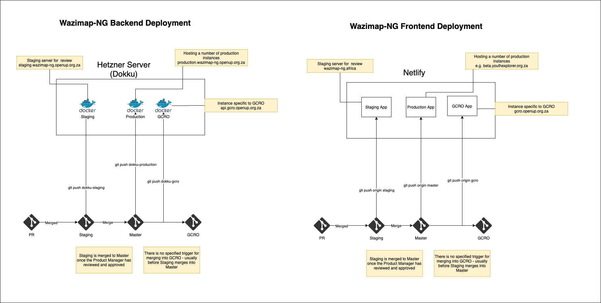

# Code Deployment

## Frontend code merge

1. Developer creates a draft PR
2. Developer completes code and removes the draft label from the PR.
3. The Trello ticket is moved from **In progress** to **Code Review.**
4. The lead dev merges the latest staging into the PR and reviews. Once the code is ready, the PR is updated with the merged code.
5. The Trello ticket is then moved into **Review \(Product Owner\)**
6. The Product Owner reviews the Netlify deploy preview. Once the implementation is approved, the Trello ticket moves to **To be deployed**
7. The Lead Developer merges the PR into staging
8. The Product Owner reviews the staging server \(on a scheduled, or ad hoc basis\)
9. Once approved, staging is merged into master which is then pushed to the production server.

This process allows to PO to review a feature before it is merged into the staging branch thereby removing the need to rollback a PR that isn't approved by the PO. One gap in this process if a bug enters the codebase during merging into staging. This can occur in the following cases:

1. PR 1 is approved, PR 2 is approved, PR 1 is merged in staging, PR 2 is merged into staging. The PO has not had the opportunity to review PR 1 and PR 2 at the same time.
2. Resolution of conflicts.

