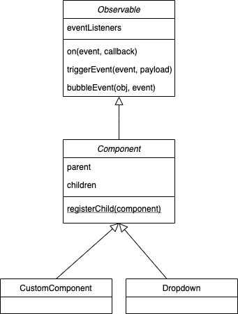
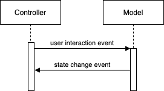

# Component Architecture

The Wazimap-NG frontend uses a custom component architecture. Over time, this will likely evolve to use a more standard framework such as [web components](https://developer.mozilla.org/en-US/docs/Web/Web_Components).


### Observable Abstract Class



All components extend the `Component` abstract class which itself extends the `Observable` abstract class. `Observable`implements the [Observer design pattern](https://en.wikipedia.org/wiki/Observer_pattern#:~:text=The%20observer%20pattern%20is%20a,calling%20one%20of%20their%20methods). Extending it gives a class the ability to register listeners and trigger events \[Note, we may move to use native CustomEvents if we adopt the web component architecture\]. Events are arbitrary string identifiers although they are often namespaced to the component itself.

For instance, when a dropdown element is selected, a dropdown component might fire the `dropdown.selected` event.

Here's an example:

```text
class DropDown extends Observable {
    static EVENTS = {
        selected: 'dropdown.selected' 
    }
    
    constructor() {
        super();
    }
    
    onElementSelected() {
        let payload = ...
        this.triggerEvent(DropDown.EVENTS.selected, payload)
    }
}
```

The `payload` is any arbitrary object and datatype that the class seeks to send to any listeners on that event.

Calling code might look something like this:

```text
let dropdown = new DropDown();
dropdown.on(DropDown.EVENTS.selected, payload => alert('An element has been selected')
```

whenever the `onElementSelected` method is called, every listener will receive the payload.

### Component Abstract Class

`Component` extends `Observable` and adds a parent-child relationship enabling components built from other components.

Instead of our Dropdown extending `Observable`, it now extends `Component`.

```text
class DropDown extends Component {
    static EVENTS = {
        selected: 'dropdown.selected' 
    }
    
    constructor(parent) {
        super(parent);
    }
    
    onElementSelected() {
        ...
    }
}
```

The calling code would look like this:

```text
class Application extends Component {
    constructor() {
        super()
        this._dropdown = new DropDown(this);
        
        this.registerChild(this._dropdown);
    }
}
```

Doing this simply stores the parent and child components. In future this may be used to bubble events or in someway communicate across the entire component hierarchy. \[Note, the Component class is still being developed\].

### Building Components

Apart from extending `Component` Wazimap-NG components use a [Model View Controller](https://en.wikipedia.org/wiki/Model%E2%80%93view%E2%80%93controller) design. The view comprises an HTML fragment, usually created by the web designer. \[These are currently embeded in index.html but may in future be separated into individual component html files.\]

The model stores the state and associated logic of the component and the controller acts as the glue between model and view, as well as handling events and interactions. 

#### Controller

Here is a basic implementation of the DropDown component.

```text
// This class implements the controller for the DropDown component.
export class DropDownComponent extends Component {
    constructor(parent, container, values = [], defaultText = '') {
        this._container = container
        this._model = new DropDownModel(values, defaultText);
        this.prepareDomElements();
        this.prepareEvents();
    }
    
    get container() {
        return this._container;
    }
    
    get model() {
        return this._model;
    }
    
    prepareDomElements() {
        this._textArea = $(this.container).find('.textArea')[0];
        this._trigger = $(this.container).find('.trigger')[0];
        this._optionContainer = $(this.container).find('.options')[0];
        this._listItem = $(self._optionContainer).find('.list_item')[0]
    }
    
    prepareEvents() {
        const self = this;
        this._trigger.on('click', () => {
            $(self._optionContainer).show();
        })
        this.model.on(DropDownModel.EVENTS.changeValue, model => {
            self.updateText();
        })
    }
    
    setOptions(values) {
        const self = this;
        this.model.options = values;
        $(this._optionContainer).html('');
        values.array.forEach((element, idx) => {
            let li = self._listItem.clodeNode(true);
            li.text(element);
            $(self._optionContainer).html('');
            let li = listItem.cloneNode(true);
            li.on('click', () => {
                self.model.currentIndex = idx;
            })
            $(self._optionContainer).append(li);
        });
    }
    
    updateText() {
        $(this._textArea).text(this.model.currentValue)
    }
    
    reset() {
        this.model.reset();
    }
}
```

A few points worth noting:

```text
constructor(parent, container, values = [], defaultText = '')
```

All components receive their parent component as the first argument. In many cases the second argument is the DOM element that contains the view HTML.

```text
constructor(...) {
    ...
    this.prepareDomElements();
    ...
}
    
...

prepareDomElements() {
    this._textArea = $(this.container).find('.textArea')[0];
    this._trigger = $(this.container).find('.trigger')[0];
    this._optionContainer = $(this.container).find('.options')[0];
    this._listItem = $(self._optionContainer).find('.list_item')[0]
}
    
...

```

By convention, the constructor calls `prepareDomElements` which prepares various DOM elements used in the component. Note how each  of the lines in `prepareDomElements` ends in `[0]`. This is due to the fact that JQuery's `find` method returns a JQuery object. By convention, DOM objects are used in models, these can easily be converted into JQuery objects using the $ function, e.g. `$(this._textArea)`.

A `prepareEvents` method is often also used to wire up events from the constructor.

```text
constructor(...) {
        ...
        this.prepareEvents();
    }
    
    prepareEvents() {
        const self = this;
        this._trigger.on('click', () => {
            $(self._optionContainer).show();
        })
        this.model.on(DropdownModel.EVENTS.changeValue, model => {
            self.updateText();
        })
    }
```

It's  is important to note that only the web designer edits the HTML directly. If addition DOM elements are needed, the component will clone existing elements:

```text
setOptions(values) {
        ...
        values.array.forEach((element, idx) => {
            let li = self._listItem.clodeNode(true); // <-- Note that the li element is being cloned from an existing one.
            li.text(element);
            ...
            $(self._optionContainer).append(li); // <--- Note how the li element is inserted into the DOM.
        });
    }
```

#### Model

While it is tempting to create the Component using a single class, separating the model from the view often results in cleaner, more robust, and easier-to-test code. The model only stores the state of the component and does not interact with either the view or the controller directly. 

It is important that the model is agnostic of the controller. In other words, the model should not hold a reference to the controller and should not call its methods. Communication takes place using either events or callbacks. While not mandatory, events are preferred as callbacks can result in slightly less-readable code. 

In the case of a DropDown component, the state that needs to be stored includes:

* Current options available in the dropdown
* The currently selected item
* Default text to display if no item is selected.

```text
class DropDownModel extends Observable {
    static EVENTS = {
        changeValue: 'dropdown.model.changevalue'
    }
    
    constructor(options = [], defaultText = '') {
        this._options = options
        this._defaultText = defaultText;
        this._currentIndex = null;
    }
    
    get options() {
        return this._options;
    }
    
    set options(values) {
        this._options = values;
        this.reset();
    }
    
    get defaultText() {
        return this._defaultText;
    }
    
    get currentIndex() {
        return this._currentIndex;
    }
    
    set currentIndex(newIdx) {
        if (newIdx != this._currentIndex) {
            this._currentIndex = newIdx;
            this.triggerEvent(DropDownModel.EVENTS.changeValue, this)
        }
    }
    
    get currentValue() {
        if (this.currentIndex == null)
            return this.defaultText;
        return this.options[this.currentIndex];
    }
    
    reset() {
        this.currentIndex = null;
    }
}

```

most of the model class looks like boilerplate, the most interesting method is the setter for `currentIndex`

```text
set currentIndex(newIdx) {
    if (newIdx != this._currentIndex) {
        this._currentIndex = newIdx;
        this.triggerEvent(DropDownModel.EVENTS.changeValue, this)
    }
}
```

Here we check if the index of the selected item has changed, if so, it is update and a `DropDownModel.EVENTS.changeValue` is fired. Recall from the DropDownComponent class above, we add a listener to this event:

```text
prepareEvents() {
    ...
    this.model.on(DropDownModel.EVENTS.changeValue, model => {
        self.updateText();
    })
    ...
}
```

which then gets the appropriate value from the model:

```text
updateText() {
    $(this._textArea).text(this.model.currentValue)
}
```

The current index value on the model is updated when the li element is clicked:

```text
setOptions(values) {
    ...
    li.on('click', () => {
        self.model.currentIndex = idx;
    })
    ...
}
```

### MVC Architecture

The benefit of using a decoupled MVC framework is that the resulting code is uncomplicated and reusable. Using this structure, it would be possible to have two controllers working with a single model. When a user interacts with the first component, the second one will automatically update. 

To ensure that the Model is decoupled from the Controller, it is usually best to separate events into two types, user interaction events and state change events. A user clicking on a box is an example of a user interaction event. They are typically primitive events. The controller notifies the model of the event by calling a method on the model object. This method will likely modify the internal state of the model. Once the state changes, a state change event is fired from the model. An example is the `changeValue` event. These events usually operate at a higher semantic level. The controller receives the state change event and updates the view accordingly. In this case, the text shown.



### A few points on style

Prefer using the `_` prefix as a signifier of a private attribute, e.g.

```text
constructor(options = [], defaultText = '') {
        this._options = options
        this._defaultText = defaultText;
        this._currentIndex = null;
    }
```

Use getters and setters

```text
get options() {
        return this._options;
    }
    
    set options(values) {
        this._options = values;
        this.reset();
    }
```

Where possible provide the simplest possible arguments to methods, e.g.

```text
doSomething(data) {
    console.log(data.key1.key2.value) // bad 
}

doSomething(value) {
    console.log(value);
}
```

Methods should receive only information that they need. Large application-wide state objects should be avoided.

