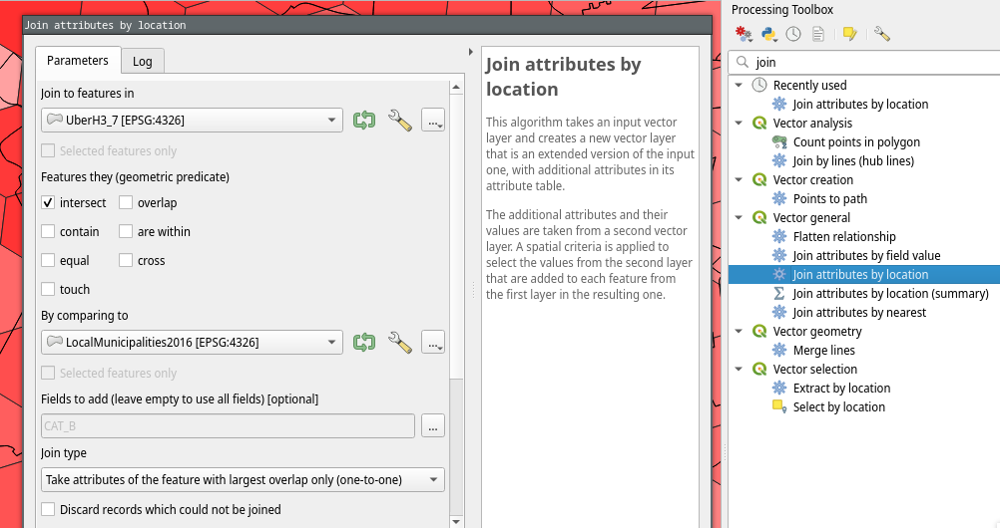

# Geographies, hierarchies and versions

See also discussion of [geography-hierarchies.md](system-architecture/geography-hierarchies.md "mention")architecture.

## Hierarchy and profile configuration considerations

A profile has a geography hierarchy which represents the set of geographies it will make available to users.

A hierarchy has a root, a default demarcation version, and a full list of the versions it supports. When a user loads a profile URL, the default version will be selected. The user can change the selected version using the child type/version dropdown on the bottom right, or by selecting an indicator which only has data for that version.

A demarcation version is used to distinguish multiple versions of the same geography boundary, e.g. wards in 2011, 2016, and 2021.

A dataset is related to a specific geography hierarchy through the profile, and a specific demarcation version. The data is related to specific boundaries via the geography codes.

When loading shapefiles, they are related to a specific geography hierarchy and demarcation version by their names. Levels in the hierarchy are distinguished via the "level" field, e.g. `country`, `ward`, `mainplace`, `equal area hexagon`. All levels that have a parent in another level must be [configured as "child types" of their parent in the profile configuration](profile-configuation.md#preferred\_children) to determine their priority for selection as the current child type shown on the map when their parent geography is selected by the user.&#x20;

### Discussion

There are some issues with hierarchies that are beginning to show their teeth.

* I think at least the upload script currently requires each geo to have a parent in the same version. That is probably not really necessary for the frontend or backend in normal use, it means redundant provinces and ZA boundaries, and weirdly the equal area hexagons are "in" the 2016 demarcation rather than just having the 2016 metros as their parents&#x20;
* Versions are keyed on their name, but they can only exist in one hierarchy, so to add a second "2016 Boundaries" I had to add (ye) to its name to distinguish it from another one yet be similar to its peer "2011 Boundaries" in youth explorer.

## Shapefiles

These are already simplified and have the right fields to import to Wazimap.

See [the tutorial for how to format with the appropriate attributes and simplify shapefiles](tutorials/loading-new-geographies.md) similarly. It also demonstrates uploading.

### South Africa 2020 demarcation

The zip file says 2021 because that's the election when it took effect but the files are labeled 2020 because that's when the changes were announced by the demarcation board.

* ZA
* Provinces
* Districts - district and metro municipalities
* LocalMuni
* Wards

Attributes

* Name
* Code
* Parent\_cod
* Area



### South Africa 2016 demarcation

* za - parent is NULL to make it a root in the hierarchy
* pr
* dc - district and metro municipalities
* local-mn
* Wards\_2016_\__geomfix

Attributes

* code
* `parent_cod` except ZA which has `parent`
* name
* area



### South Africa 2011 demarcation

### Equal area hexagons (Uber H3 resolution 7)

Attributes:

* code
* parent\_cod
* area
* name

Resolution 7 hexagons.

Only hexagons overlapping with metros in the South Africa 2016 demarcation are included.

The metro with the greatest overlapping area was selected when multiple options were available using the _QGIS Processing Toolbox > Join Attributes by location_ tool.

<figure><figcaption></figcaption></figure>



&#x20;
