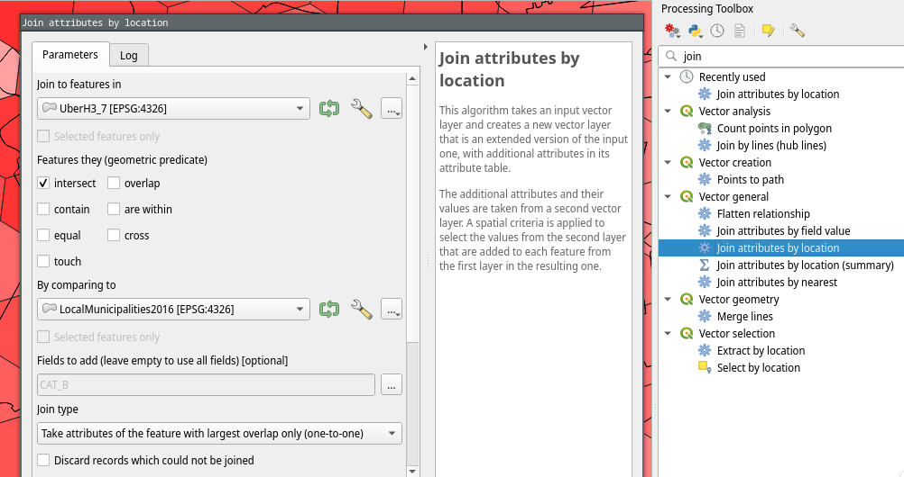

# Geographies/Shapefiles

These are already simplified and have the right fields to import to Wazimap.

See [the tutorial for how to format with the appropriate attributes and simplify shapefiles](tutorials/loading-new-geographies.md) similarly.

## South Africa 2020 demarcation



## South Africa 2016 demarcation



## South Africa 2011 demarcation

## Equal area hexagons (Uber H3 resolution 7)

Resolution 7 hexagons.

Only hexagons overlapping with metros in the South Africa 2016 demarcation are included.

The metro with the greatest overlapping area was selected when multiple options were available using the _QGIS Processing Toolbox > Join Attributes by location_ tool.

<figure><figcaption></figcaption></figure>



&#x20;
