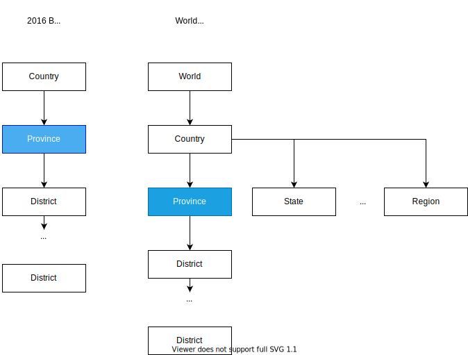

# NGP3 - Change Geography Hierarchies

## **NG Proposal 3 - Geography Hierarchies**

**Proposed by: Adi Eyal**

**Date: 2020-09-06**

**Status: Work in progress**

### **Context**

Read about Geography Hierarchies [here](system-architecture/geography-hierarchies.md).\

## **Current Challenges**

#### **Sharing levels across hierarchies**

The current architecture considers levels to belong to only a single hierarchy. For instance **Wards** **version 2016**, belongs to the **2016 Boundaries Hierarchy**.  There are occasions where this level might be relevant to another hierarchy. South African **Provinces** are useful in both **South African hierarchies** as well as a **World** hierarchy. For this level to belong to both hierarchies, another version of the boundaries must be uploaded.\
****

This limitation is inconvenient and creates database bloat by storing a second copy of the boundaries.\

#### ****

****\
**Sharing datasets across hierarchies**

The limitation above also has an impact on datasets associated with these geographies. Since datasets are tied to a particular hierarchy, it is impossible to use the same data with another hierarchy, even if they share boundaries.

**Children can only have one parent**

Child geographies explicitly identify their parent when uploaded. This prevents hierarchies where a child can be reached through different paths.\
****

#### **Insufficient namespacing**

Geographies belong to a particular level and version. There are cases where the same term may be used for different levels causing confusion. For instance, a **District** in South African may not be comparable to a district in another country which may fit in a different position in the hierarchy.&#x20;

#### Version of ancestors

You need to know which version of ancestors to show to potentially navigate away from the selected geography.

In the image below, the hexagons should be children of the 2016 Mangaung but are incorrectly added as children of the smaller 2011 Mangaung. Hexagons are technically not part of the municipal demarcation, but in one demarcation version, hexagon _a_ might be best presented a child of one municipality, and in another demarcation version, it would be a child of another.&#x20;

This raises the question of which demarcation version to use to determine the ancestors for the breadcrumb and ancestor siblings for the map navigation.

### **Proposed Solution**

#### **Sharing levels across hierarchies**

Decoupling levels from hierarchies would add flexibility when constructing hierarchies. Geographies are not associated with any particular hierarchy when they are uploaded. An admin is then able to create a hierarchy by choosing which levels to include in it. Geographies are differentiated by the combination of their namespace and code, whereas child geographies refer to their parents only by code. To make this concrete, a useful example is to consider that South Africa changes municipal boundaries every five years. The current boundaries were drawn up in 2016 and the previous ones in 2011. I can upload 2011 municipalities and 2016 municipalities. Many of the municipalities in each geography set may have the same code, e.g. City of Cape Town has the code CPT in both sets. We can uniquely identify a particular boundary by prefixing it with its namespace.&#x20;

In both cases, CPT points to WC as its parent. The namespace is not explicit. This allows us to create a new Geography Hierarchy that combines 2011 Municipalities with 2016 Provinces. We simply add these sets of Geographies to the same Geography Hierarchy. A 2011 Geography will identify any available parent Geography which has the correct code. In this case, 2011 CPT will link to 2016 WC.

The Geography Hierarchy itself does not actually encode the hierarchical relationship between Geographies. This is already encoded in the Geography itself.\
****

Implementing this change would require a change in the database structure of how hierarchies are stored in the database. [Treebeard](https://github.com/django-treebeard/django-treebeard) is currently being used to manage hierarchies using [Materialized Path Trees](https://django-treebeard.readthedocs.io/en/latest/mp\_tree.html). These data structures effectively hard-code geography hierarchies. Materialized Path Trees are useful for efficient multi-generational queries, such as finding all descendants of a selected geography. No compelling use case has been presented that requires these types of queries. A simplified table structure may be appropriate in this case.

This proposal not only addresses the current limitation of not being able to share Geographies across Geography Hierarchies, but we also benefit from not requiring to duplicate data. Data is associated with a Geography, irrespective of the hierarchy it is in. A minor modification is for new data uploads to be assigned a namespace since data files would typically not be explicit about the namespace.

#### Multiple parents

Unfortunately, this proposal cannot accommodate a Geography with multiple parents. A modification to this design may be able to address this issue as well. The source of this limitation is how spatial data is imported into the database. Each Geography already names the code of a single parent. A possible direction to explore is creating a many-to-many table when Geographies are loaded into the system. Using this table, it would be possible to query the children of a particular Geography, and not only child Geographies that have a given Geography as a parent.&#x20;

****

.\
****\
****\
****

## **Recommendation**
