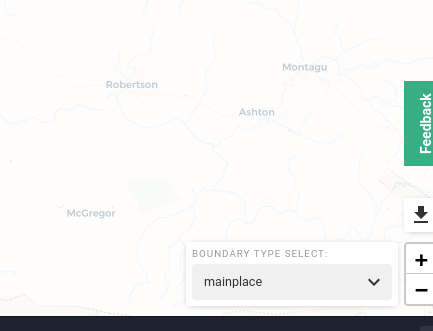

# Profile Configuration

A number of configuration options are available to control how then application is set-up. They can be set in the configuration field of the profile model, e.g.: [https://production.wazimap-ng.openup.org.za/admin/profile/profile/](https://production.wazimap-ng.openup.org.za/admin/profile/profile/)

### Full profile configuration example

Here is an example of what how such a configuration might look.

```text
{
  "urls": [
    "wazimap-ng.africa"
  ],
  "choropleth": {
    "colors": [
      "#eff3ff",
      "#bdd7e7",
      "#6baed6",
      "#3182bd",
      "#08519c"
    ],
    "opacity": 0.7,
    "opacity_over": 0.8
  },
  "tile_layers": [
    {
      "url": "https://{s}.basemaps.cartocdn.com/rastertiles/voyager_only_labels/{z}/{x}/{y}.png",
      "pane": "labelsPanel",
      "zIndex": 650
    },
    {
      "url": "https://{s}.basemaps.cartocdn.com/rastertiles/voyager_nolabels/{z}/{x}/{y}.png",
      "pane": "tilePane",
      "zIndex": 200
    }
  ],
  "layer_styles": {
    "selected": {
      "out": {
        "color": "#666666",
        "weight": 1,
        "opacity": 0.5,
        "fillColor": "#cccccc",
        "fillOpacity": 0.5
      },
      "over": {
        "color": "#666666",
        "fillColor": "#3BAD84",
        "fillOpacity": 0.6
      }
    },
    "hoverOnly": {
      "out": {
        "stroke": false,
        "fillColor": "#ffffff"
      },
      "over": {
        "fillColor": "3BAD84",
        "fillOpacity": 0.5
      }
    }
  },
  "default_panel": "point_data",
  "root_geography": "CPT",
  "leaflet_options": {
    "minZoom": 6
  }
}
```

### urls

```text
"urls": [
    "wazimap-ng.africa"
]
```

This section is used to determine which profile information should be used. It matches the URL of the client application. In this case, a website with https://wazimap-ng.africa as a URL will use this profile. A number of urls are possible to map to a single profile.

#### page\_title

```text
"page_title": "This is a new title"
```

`page_title` overrides the title on the frontend. 

#### choropleth

```text
"choropleth": {
  "colors": [
    "#eff3ff",
    "#bdd7e7",
    "#6baed6",
    "#3182bd",
    "#08519c"
  ],
  "opacity": 0.7,
  "opacity_over": 0.8
}
```

This section determines the colours used for the choropleths creating in the map explorer

#### preferred\_children

```text
"preferred_childre": {
    "country": [
        "province", "state"
    ],
    "province": [
        "district",
        "metro"
    ],
    "municipality": ["mainplace", "ward"],
    ...
}

```

### 

Previous versions of Wazimap assumed a linear geography hierarchy. The current version allows for a [tree-like structure](system-architecture/geography-hierarchies.md). When a particular level has two potential children, e.g. `country` might be the parent of both `province` and `state`. When a choice is available, the user interface provides the user with a select box to choose which geographies to show. The `preferred_children` specifies which geographies are the default.



### Side panel configuration

In some cases, not all side panels need to be visible. For instance, where no point data is going to be displayed, the point data panel can be hidden. This can be configured using the following:

```text
{
    "panels": {
        "rich_data": {
            "visible": true
        },
        "point_data": {
            "visible": true
        },
        "data_explorer": {
            "visible": false
        },
    },
    "default_panel": "rich_data"
}
```

Each of these values is optional. If it is missing then that panel will be displayed by default.

### Customising the tutorial text

It is possible to customise the text and images for the tutorial by added the "tutorial" key as shown below

```text
"tutorial": [
    {
      "body": "This website was developed to enable you to easily find spatial information related to geographic areas. By clicking on the map or using the search bar, you can navigate to an area of interest and find relevant information about it.",
      "image": "https://wazimap-ng.s3-eu-west-1.amazonaws.com/GCRO/Screenshot+1.jpg",
      "title": "Introduction:"
    },
    {
      "body": "To get started, first select a location on the map or use the search box to find the location you would like to analyse.",
      "image": "https://wazimap-ng.s3-eu-west-1.amazonaws.com/GCRO/Screenshot+2.jpg",
      "title": "Location Search:"
    },
    {
      "body": "Basic information for your selected location can be found in the Location Panel. Use the buttons to navigate to parent locations.",
      "image": "https://wazimap-ng.s3-eu-west-1.amazonaws.com/GCRO/Screenshot+3.jpg",
      "title": "Location Panel:"
    },
    {
      "body": "To view rich data specific to the location you selected, open the Rich Data panel in the left toolbar.",
      "image": "https://wazimap-ng.s3-eu-west-1.amazonaws.com/GCRO/Screenshot+4.jpg",
      "title": "Rich Data:"
    },
    {
      "body": "To add point data to the map, use the Point Mapper to show different facilities in that area.",
      "image": "https://wazimap-ng.s3-eu-west-1.amazonaws.com/GCRO/Screenshot+5.jpg",
      "title": "Point Mapper:"
    },
    {
      "body": "To overlay compatible datasets onto your location, open the Data Mapper and choose from the available indicators.",
      "image": "https://wazimap-ng.s3-eu-west-1.amazonaws.com/GCRO/Screenshot+6.jpg",
      "title": "Data Mapper:"
    },
    {
      "body": "Once you've mapped a data-set (eg. gender), use the Data Filter to select a sub-indicator for that data-set (eg. male)",
      "image": "https://wazimap-ng.s3-eu-west-1.amazonaws.com/GCRO/Screenshot+7.jpg",
      "title": "Data Filtering:"
    },
    {
      "body": "For more information on how to use specific features, look out for tutorial icons. For an in-depth guide on using this site, please see our user manual.",
      "image": "https://wazimap-ng.s3-eu-west-1.amazonaws.com/GCRO/Screenshot+7.jpg",
      "title": "Learn more:"
    }
  ]
```

### Leaflet Options

It's possible to use Leaflet configuration options as described here: [https://leafletjs.com/reference-1.7.1.html\#map-l-map](https://leafletjs.com/reference-1.7.1.html#map-l-map). 

```text
"leafletOptions": {
  "minZoom": 4
}
```

### Custom styles

Custom styles can be injected through the profile, e.g.:

```text
"style": {
    "location__search_input": [
        {
            "key": "background-color",
            "value": "blue"
        }
    ]
}
```

### To be cleaned up

* rootGeography: This is the default geography - currently hard-coded as ZA but in time we need to cater for other starting geographies
  * admins to select one of the previously loaded geographies
* individualMarkerLevels: level at which individual point markers are shown instead of dots
  * admins to select one of the previously loaded geographies
* defaultCoordinates : currently hard-coded as {"lat": -28.995409163308832, "long": 25.093833387362697};
  * admins to select a point off of the map
* default zoom level : this defines the zoom level of the map. currently hard-coded as 6
  * admins to select available zoom levels from a dropdown list
* map selected boundary color and hover over color
  * admins to select colours from predefined swatches \(Jen to check with Matt\)

### Tranlations

`translations` property consists of key-value pairs. The keys of the translations property\(i.e "Point Mapper" in the sample config below\) must be added as an attribute\(`data-i18n`\) to the element that wraps the text to be translated. This can be done by a developer or a designer in index.html.

```text
//sample config
translations: {
    'en': {
      'Point Mapper': 'Services'
    }
  },
```

