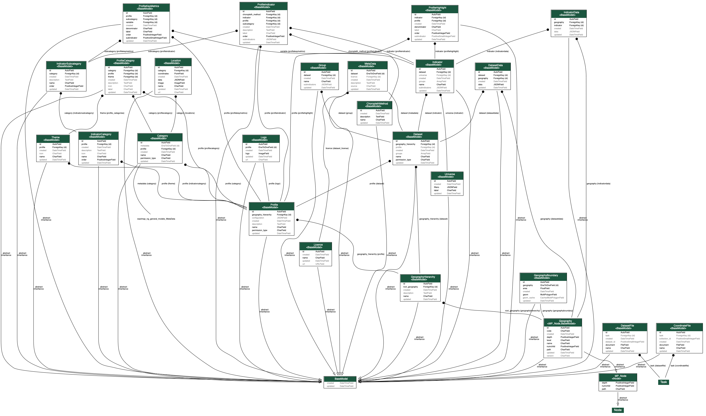
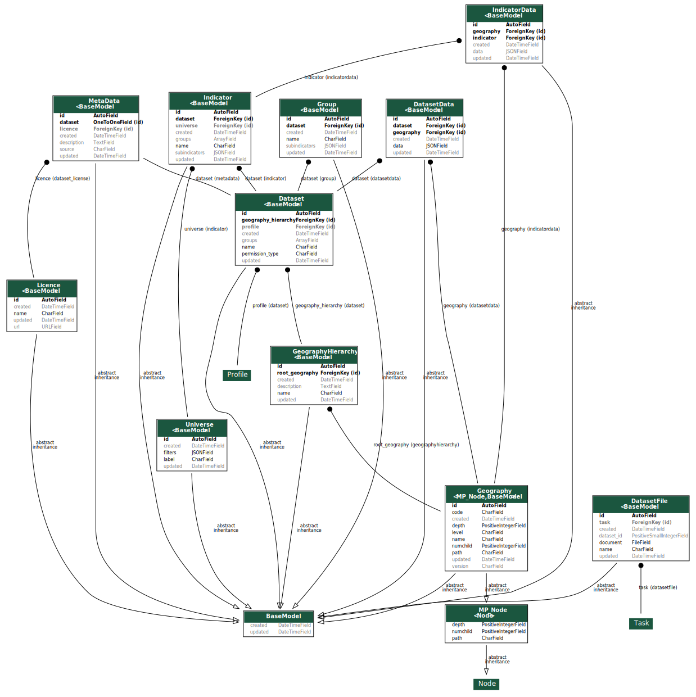
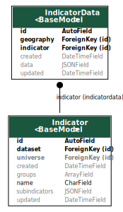
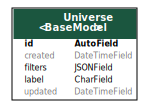
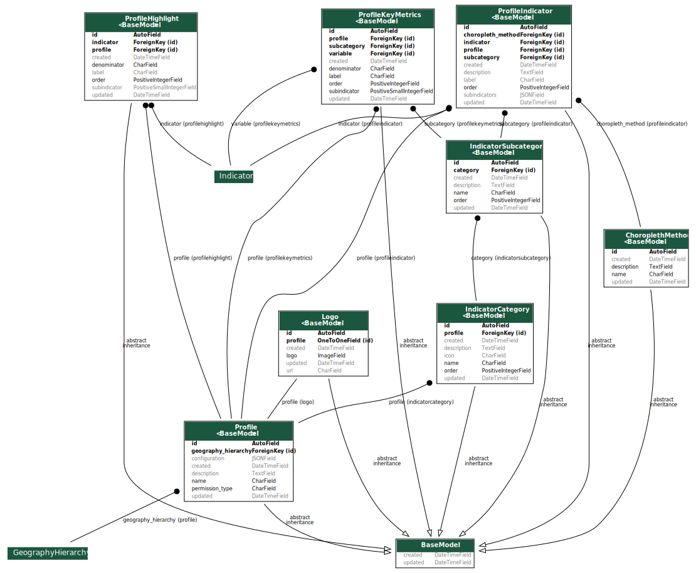
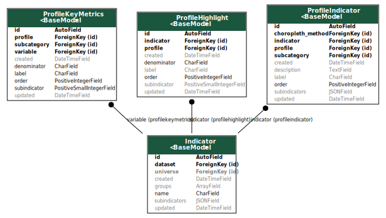
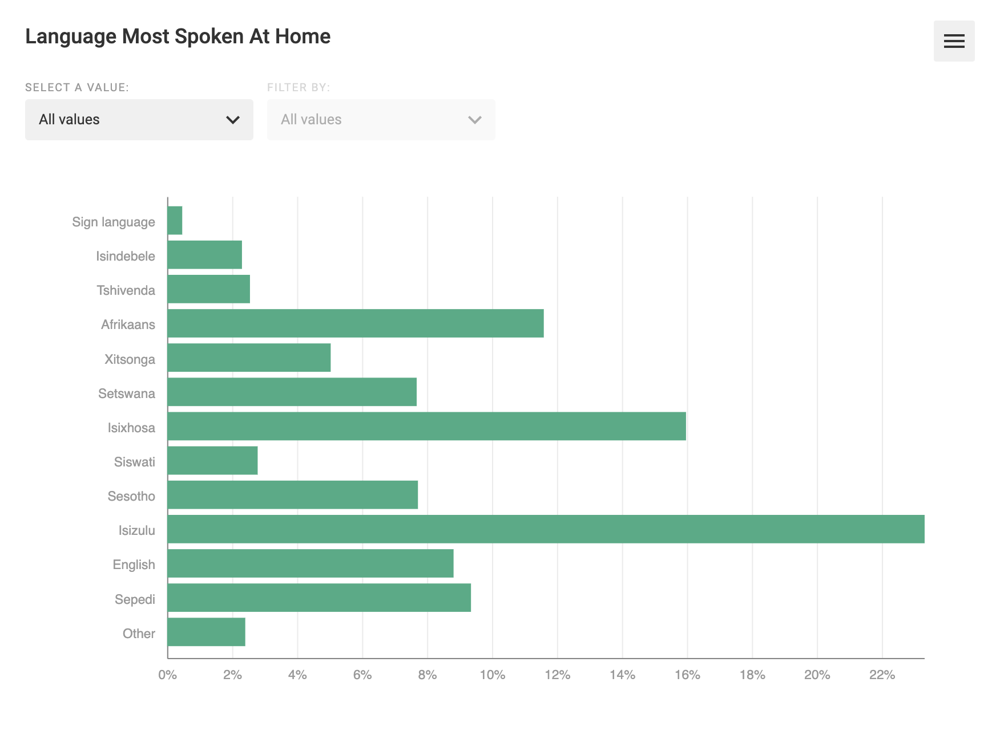
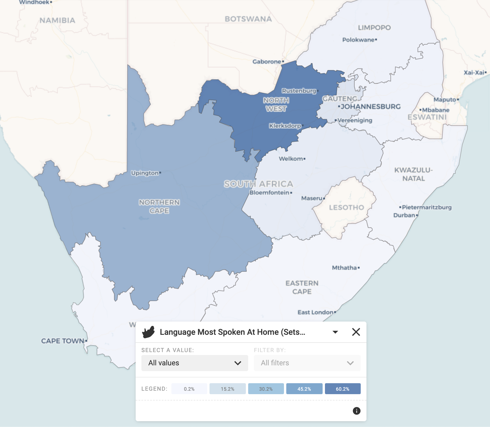
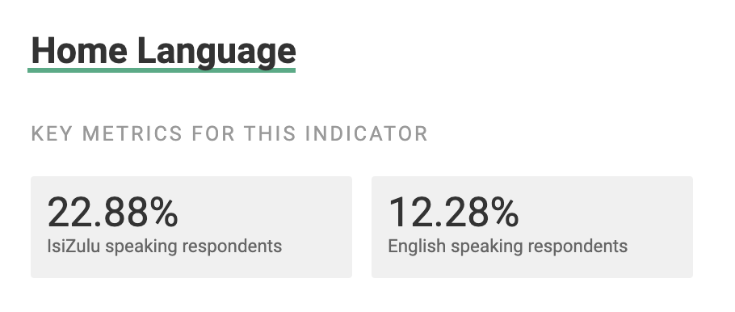
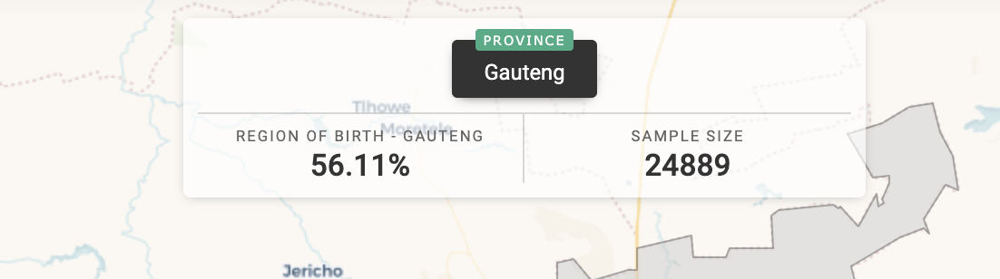

# Database Models



The Django apps and database models are divided into roughly two groups: models that store data, and models that are used to present information to the end-user.


## Datasets App



### Dataset and DatasetData

.svg>)

Data models can be found in the **datasets** app. The central model is **Dataset. **It represents a dataset that was uploaded by the [**Data Administrator**](broken-reference)**. **Each dataset is associated with a [Geography Hierarchy](geography-hierarchies.md). Data files uploaded to the system are expected to have the following structure:

| Geography | Group 1 | Group 2 | ... | Group N | Count         |
| --------- | ------- | ------- | --- | ------- | ------------- |
| geography | Value 1 | Value 2 |     | Value N | #observations |

Only the **Geography**, **Count**, and at least one additional column are required.  An example table might look as follows:

| Geography | Gender | Age | Count |
| --------- | ------ | --- | ----- |
| ZA        | Male   | 20  | 10    |
| ZA        | Male   | 21  | 12    |
| ZA        | Female | 20  | 15    |
| ZA        | Female | 21  | 13    |
| ...       |        |     |       |
| WC        | Male   | 20  | 5     |
| ...       |        |     |       |

 When this file is uploaded, a new **Dataset** object is created. Each row is stored in a **DatasetData **object. A typical DatasetData object might look as follows:

```
{
    Geography: ZA # Geography is actually stored in its own field and not in the JSON field. 
    Gender: Male,
    Age: 20,
    Count: 10
}
```

All groups and the **Count** column are stored in a JSONField. 

### Indicators and IndicatorData

Another key concept is an **Indicator**. **Indicators** represent saved aggregations and filters on a dataset. For example, the above Dataset can be used to create an Indicator containing population per geography disaggregated by gender. The equivalent query in SQL would look something like this:

```
Select
    Geography,
    Gender,
    Sum(Count)
From 
    Dataset d
Where
    d.id = XXX
Group by
    Geography,
    Gender
```

Similarly, another indicator can be created to return population disaggregated by age.

```
Select
    Geography,
    Age,
    Sum(Count)
From 
    Dataset d
Where
    d.id = XXX
Group by
    Geography,
    Age
```

When a new indicator is created, data from **DatasetData** is processed to create an IndicatorData object, one per geography.  A simplified version of and **IndicatorData** would like something like this:

```
{
  Geography: ZA,
  subindicators: {
   Male: 22,
   Female: 28
  }
  ... # other information is stored here and is described elsewhere in this manual.
}
```

The actual structure of IndicatorData objects is a little more complicated. More detail can be found here: [IndicatorData](indicatordata.md).



### Universe

**Universes** represent saved filters on queries and enable the Data Administrator to run a query on a subset of the database. The default **Universe **is the total of all the distinct observations in a geography (e.g. the total population of the geography). It is possible to create a custom **Universe **and apply it to an **Indicator. ** 



A **Universe **which creates a filter on gender can enable queries on Female exclusively. PseudoSQL to represent this operation

```
Select
    Geography,
    Age,
    Sum(Count)
From 
    Dataset d
Where
    d.id = XXX
    and Gender = Female
Group by
    Geography,
    Age
```


The **Universe **filters field contains a dictionary that will be used in a Django ORM filter method. Below is an example filter to extract adults 60 and older.

```
{
    'Age Group__in': ['60-64', '65-69', '70-74', '75-79', '80-84', '85+']
}
```

This filter is then passed to the Django ORM as follows:

```
Dataset.objects.filter(**universe.filters) # pseudocode
```

Other noteworthy models are Geography and GeographyHierarchy. These are discussed in more detail here: [Geography Hierarchies](geography-hierarchies.md). 

## Profile App



Whereas models in the Datasets app focus on data, Profile App models are for presentation to end-users. The key model is **Profile**. A **profile** is a view of the data curated by the [Profile Administrator](broken-reference). Each profile can be considered to be a complete Wazimap instance. A **profile **organises tabular data in Categories (**IndicatorCategory**) and Subcategories (**IndicatorSubcategory**). This data can be presented using three different models:

**ProfileIndicator**, **ProfileKeyMetrics**, and **ProfileHighlight. ProfileIndicator **is the most commonly used of the three.  



**ProfileIndicators **present Indicators. They provide explanatory text, a custom label, and other attributes that control presentation. They are used in the Rich Data Panel in the form of graphs and the Data Mapper Panel in the form of [choropleth maps](choropleth-maps.md).





**ProfileKeyMetrics **display only a single value from an Indicator. For instance, the number of youth between 15-24 living in the area.



ProfileHighlights are similar to ProfileKeyMetrics in that they display a single value from an Indicator, but are displayed in the Map View rather than the Rich Data View.



## Points App
