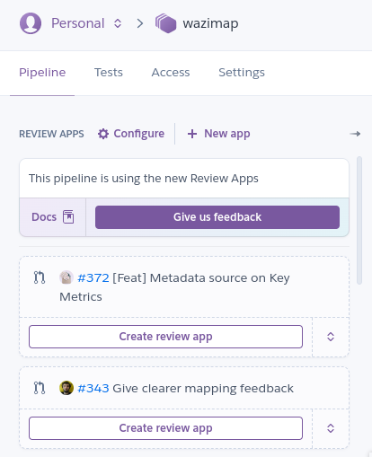

# Heroku Review Apps

### Creating a review app

1. Login to the heroku dashboard
2. Go to the wazimap pipeline
3. Click "Create review app" for your pull request

Find the URL to the deployed review app in the pull request or by clicking "View app" in heroku.

Migrations and demodata are only loaded when the app is created. If you need to recreate the database, destroy the app and recreate it.

### Connecting a netlify frontend deploy preview to backend review app

* Copy link for frontend review app ex: [deploy-preview-542--wazimap-staging.netlify.app](https://deploy-preview-542--wazimap-staging.netlify.app/)
* Add it to the configuration in profiles for the backend review app and save\
  
* Go to Ui deploy preview add ?dev-tools=true to enable dev tools and add `deploy-preview-542--wazimap-staging.netlify.app` to Hostname and backend review app url to Api url `https://wazireview.herokuapp.com` and enter\
  .png>)

## Creating staging apps in heroku

This is probably not helpful any more now that real review apps work again, but we're leaving this here for now in case it's needed.

We were creating "review apps" in the staging "stage" of the wazimap pipeline in heroku while heroku review apps were not working due to the exfiltration of github oauth keys.

### Create a new app

We name apps according to the pull request number, e.g. wazimap-pr-1234 for PR #1234

#### Steps for creating an app via CL

* `heroku login`

In the project directory (to update your project git remotes):

* `heroku apps:create wazimap-pr-1234 --remote heroku-pr-1234`
* `heroku pipelines:add wazimap --app wazimap-pr-1234 --stage staging`

#### Steps for creating an app via GUI

* Login into Heroku Web
* Go to wazimap pipeline
* After opening wazimap pipeline there is an option to add new staging app\
  
* Open the newly created app and go to deploy\
  .png>)
* Copy command to add remote for existing repo and paste it to your command line inside wazi backend repo to add this app as heroku remote\
  .png>)

### Steps for setting up the stack

* `heroku stack:set container --app wazimap-pr-1234`
* Adding Addons:
  * `heroku addons:add heroku-postgresql:hobby-dev --app wazimap-pr-1234`
  * `heroku addons:add heroku-redis:hobby-dev --app wazimap-pr-1234`
* Adding Config vars:\
  `heroku config:set DJANGO_SECRET_KEY=3423424 AWS_ACCESS_KEY_ID=xxx AWS_SECRET_ACCESS_KEY=xxx AWS_STORAGE_BUCKET_NAME=xxx AWS_S3_REGION_NAME=xxx --app wazimap-pr-1234`

### Deploying branch

* git add and commit everything you want to deploy
* `git push heroku-pr-1234 BranchName:master`

### Post-release step

Start Worker dynos

Via CLI:

`heroku ps:scale worker=1 --app` `wazimap-pr-1234`

Via GUI:

* Go to overview on app in heroku dev center and there will option to see dyno formation\
  click on configure dyno link on right hand side\
  .png>)
* Switch on the dyno to run Qcluster (click on edit and turn the toggle on)\
  

* `heroku run python3 manage.py migrate --app` wazimap-`pr-1234`
* `heroku run python3 manage.py loaddata demodata.json --app` wazimap-`pr-1234`
* `heroku run python3 manage.py createsuperuser --app` wazimap-`pr-1234` if you want to create new supruser

### Usefull commands

* Check configs for review app via cli\
  `heroku config --app` wazimap-`pr-1234`
* Define region while creating app\
  `heroku apps:create` wazimap-`pr-1234 --remote staging --region eu`
* Checking logs
  * worker logs : `heroku logs --dyno=worker --app` wazimap-`pr-1234 --tail`
  * web logs: `heroku logs --dyno=web --app` wazimap-`pr-1234 --tail`

### Connecting backend review app to deploy preview app

* Copy link for frontend review app ex: [deploy-preview-542--wazimap-staging.netlify.app](https://deploy-preview-542--wazimap-staging.netlify.app/)
* Add it to the configuration in profiles for the backend review app and save\
  
* Go to Ui deploy preview add ?dev-tools=true to enable dev tools and add `deploy-preview-542--wazimap-staging.netlify.app` to Hostname and backend review app url to Api url `https://wazireview.herokuapp.com` and enter\
  .png>)\

### Destroy review apps when branches are merged

`heroku apps:destroy wazimap-pr-1234`
