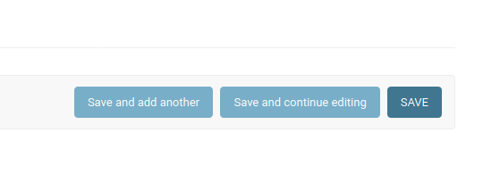
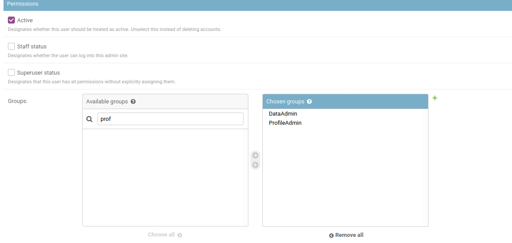

# Creating a new admin user

Admin users are responsible for loading data and managing profiles. Be careful when giving someone admin access. Wazimap does not currently have an UNDO feature which means that any accidental deletion may require a database restore in order to recover.

Create a new admin account as follows:

1. Navigate to the user creation page: [https://production.wazimap-ng.openup.org.za/admin/auth/user/add/](https://production.wazimap-ng.openup.org.za/admin/auth/user/add/)

2\. Select a username and secure password (important for the production site)

3\. Press **Save and continue editing** (don't only press save)

4\. Add details under **Personal info** (optional)

5\. Under Permissions, select **Staff status**

6\. Don't provide superuser access unless you know what you're doing.

7\. Under groups, select Data Admin and Profile Admin&#x20;

8\. In the **Available groups** selector, also select all of the profiles that that administrator should have access to.

9\. Push **Save**\
\
