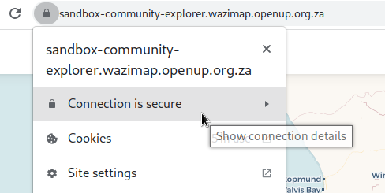
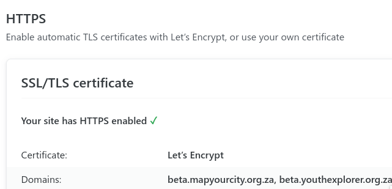
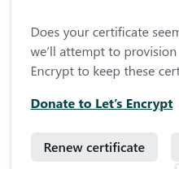

# Creating a new profile

Here is a quick tutorial that explains how to create a new profile. There are two parts, a) the frontend site and b) the backend profile.

## Setting up the DNS

Cloudflare manages the DNS records for openup.org.za. If we will be using an openup.org.za subdomain, add a record there. On the Cloudflare dash, find the domain you would like to use and add a CNAME record pointing to `inspiring-dubinsky-c19ab4.netlify.com`

Create a new domain name and point it to the Wazimap-NG server. In this case I am creating a new CNAME DNS entry called [covid.openup.org.za](https://covid.openup.org.za) that redirects to Netlify which is currently hosting the Wazi-NG frontend.


## Setting up the frontend

Add the new domain name to the Netlify configuration. Find the [configuration on this page](https://app.netlify.com/sites/wazimap-production/settings/domain).


After adding the alias the SSL/TLS certificate should renew to be valid for the new hostname.

Look for the lock icon when you visit the new hostname

<figure><figcaption></figcaption></figure>

Check the status at the HTTPS section:

<figure><figcaption></figcaption></figure>

If after 10 minutes it hasn't renewed, click Renew Certificate and check in another 10 minutes.

<figure><figcaption></figcaption></figure>

## Setting up the backend

The backend is also simple to create. Login at [https://production.wazimap-ng.openup.org.za/admin](https://production.wazimap-ng.openup.org.za/admin) and add a new profile [https://production.wazimap-ng.openup.org.za/admin/profile/profile/add/](https://production.wazimap-ng.openup.org.za/admin/profile/profile/add/).&#x20;


Provide a useful name for the profile - this one will be called Covid. Choose a [Geography Hierarchy](../system-architecture/geography-hierarchies.md). I am choosing the pre-installed **2016 boundaries with wards** hierarchy. This uses boundaries used in the 2016 South African municipal elections.


Assign the new domain name created above in the config field

```
{
  "urls": [
    "covid.openup.org.za"
  ]
}
```

Here is my completed profile screen


Save and you're done.

Visit [http://covid.openup.org.za/](http://covid.openup.org.za/) to see if everything is setup. It should look like the image below.


